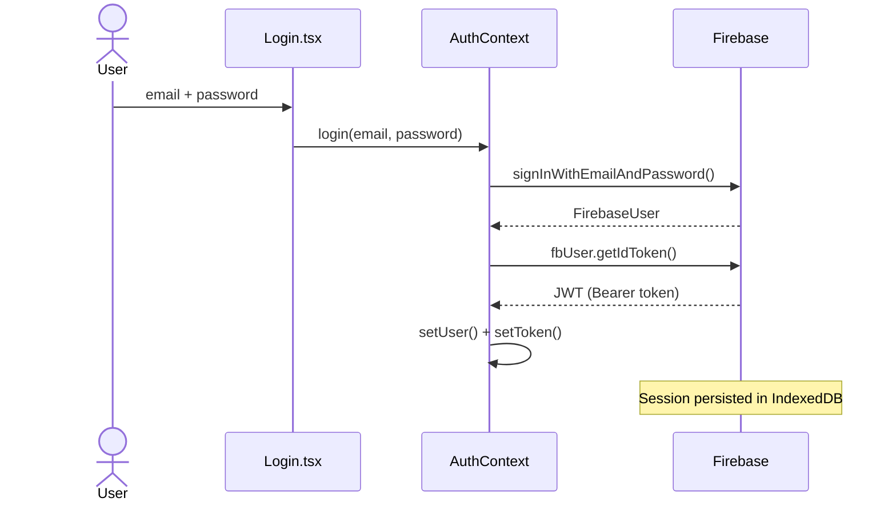

# University Library

A single-page application (SPA) for a university library system. Users can search millions of books via the Open Library API, manage loans with due-date tracking, maintain a wishlist with reading status, and authenticate securely with Firebase.

**Live demo:** https://capstone-six-ashy.vercel.app

---

## Features

- **Book search & catalog** — full-text search, filter, and sort powered by Open Library
- **Featured carousel** — curated book showcase on the home page (Swiper)
- **Book details** — cover, description, subjects, and availability per title
- **Loan system** — borrow books, track due dates, and return them
- **Wishlist & reading status** — mark books as *Reading*, *Completed*, or *Wishlist*
- **Authentication** — register and log in with Firebase Auth (JWT, session persisted)
- **Protected routes** — `/loans` requires authentication
- **Dark / Light theme** — toggled from the sidebar
- **Fully typed** — TypeScript throughout
- **Lazy-loaded routes** — each page is code-split for faster initial load
- **Local storage persistence** — loans and wishlist survive page refreshes

---

## Tech stack

| Layer | Technology |
|---|---|
| UI | React 18 + TypeScript |
| Routing | React Router DOM v6 |
| Styles | CSS Modules + SASS |
| HTTP | Axios |
| Auth | Firebase Authentication |
| State | Context API |
| Data | Open Library REST API |
| Carousel | Swiper |
| Build | Vite |
| Tests | Vitest + React Testing Library |
| Deploy | Vercel |

---

## Getting started

### Prerequisites

- Node.js 18+
- A Firebase project with **Email/Password** authentication enabled

### Installation

```bash
git clone https://github.com/web-development-SOP/capstone.git
cd capstone
npm install
```

### Environment variables

Create a `.env.local` file in the project root:

```env
VITE_FIREBASE_API_KEY=your_api_key
VITE_FIREBASE_AUTH_DOMAIN=your_project.firebaseapp.com
VITE_FIREBASE_PROJECT_ID=your_project_id
VITE_FIREBASE_STORAGE_BUCKET=your_project.appspot.com
VITE_FIREBASE_MESSAGING_SENDER_ID=your_sender_id
VITE_FIREBASE_APP_ID=your_app_id
```

### Run locally

```bash
npm run dev
```

Open [http://localhost:5173](http://localhost:5173) in your browser.

---

## Available scripts

| Command | Description |
|---|---|
| `npm run dev` | Start development server |
| `npm run build` | Type-check and build for production |
| `npm run preview` | Preview the production build locally |
| `npm test` | Run all tests once |
| `npm run test:watch` | Run tests in watch mode |

---

## Project structure

```
src/
├── components/       # Reusable UI components (BookCard, SearchBar, Spinner, …)
├── context/          # React Contexts (Auth, Loans, Wishlist, Theme, BookCache)
├── hooks/            # Custom hooks (useFetch)
├── layouts/          # AppLayout with sidebar and Outlet
├── pages/            # Route-level pages (Home, Catalog, BookDetail, Loans, …)
├── services/         # API layer (Open Library)
├── tests/            # Unit and integration tests
└── types/            # Shared TypeScript interfaces and types
```

---

## Authentication flow



---

## Testing

The test suite covers the most critical components and the core data-fetching hook.

```bash
npm test
```

| File | Reason |
|---|---|
| `Login.test.tsx` | Entry point — if the form breaks, nobody can log in |
| `ProtectedRoute.test.tsx` | Guards all authenticated routes |
| `BookCard.test.tsx` | Most-rendered component in the app |
| `useFetch.test.ts` | All external data flows through this hook |

---

## Deployment

The app is deployed on **Vercel** with automatic deploys on every push to `main`.

Firebase credentials are stored as environment variables in the Vercel dashboard — no secrets in the repository.

`vercel.json` includes a rewrite rule so direct URL access and hard refreshes work correctly on the SPA:

```json
{
  "rewrites": [{ "source": "/(.*)", "destination": "/" }]
}
```

---

## Screenshots

| Home | Book Detail | Loans |
|---|---|---|
|  |  |  |

---

## License

Academic project — Universidad, Semester 6 Web Development Capstone.
