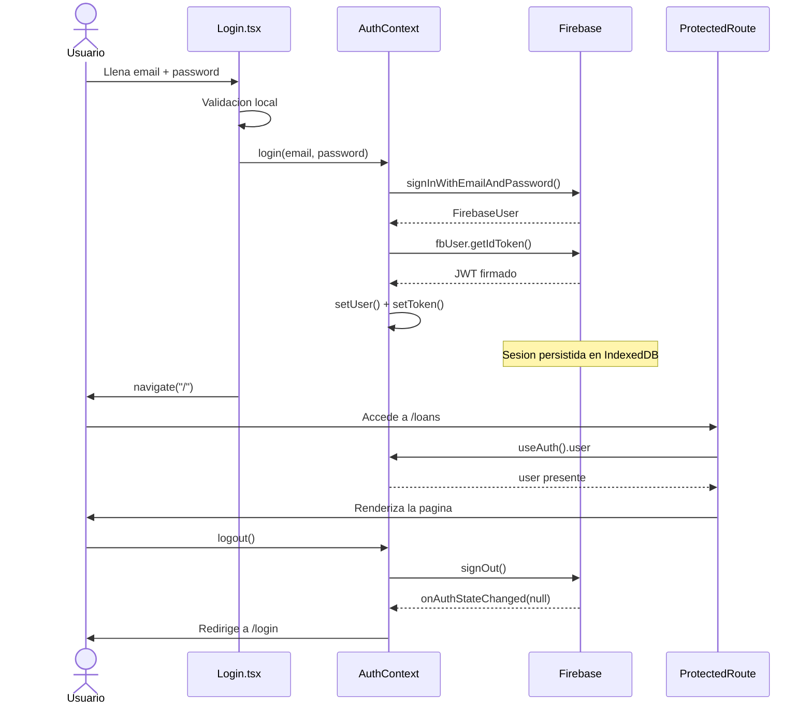

# UniLib — University Library SPA

Aplicacion de biblioteca universitaria inspirada en Steam, construida con React 18 + TypeScript + Firebase Auth como proyecto capstone del semestre 6.

**Live URL:** https://capstone-six-ashy.vercel.app

---

## Que es esta aplicacion

Construi una SPA (Single Page Application) que simula el sistema de prestamos de una biblioteca universitaria. Los usuarios pueden buscar libros usando la Open Library API, ver el detalle de cada libro, agregar libros a una lista de deseos y gestionar sus prestamos. La pagina de prestamos esta protegida — solo se puede acceder despues de iniciar sesion.

---

## Screenshots

### Home — Catalogo de libros


### Detalle de libro


### Login


### Mis Prestamos (ruta protegida)


---

## Pruebas

Para correr las pruebas:

```bash
npm install
npm test
```

Resultado esperado:

```
Test Files  7 passed (7)
     Tests  31 passed (31)
```

Implemente 7 archivos de prueba con Vitest y React Testing Library. Escogi los componentes y hooks mas criticos del flujo de la aplicacion:

| Archivo | Que prueba | Casos |
|---|---|---|
| `Spinner.test.tsx` | Componente `<Spinner>` | Label por defecto, label personalizado |
| `SearchBar.test.tsx` | Componente `<SearchBar>` | Render, submit, trim de espacios, input vacio, estado de carga |
| `BookCard.test.tsx` | Componente `<BookCard>` | Imagen de portada, letra placeholder, badge de disponibilidad, link de detalle |
| `useFetch.test.ts` | Hook `useFetch` | URL nula, estado de carga, respuesta exitosa, error de red |
| `ProtectedRoute.test.tsx` | Componente `<ProtectedRoute>` | Spinner mientras carga sesion, redireccion a `/login`, render de children con sesion activa |
| `Login.test.tsx` | Pagina `<Login>` | Render del formulario, validacion de campos vacios, email invalido, submit correcto, navegacion post-login, error de credenciales |
| `AuthContext.test.tsx` | Hook `useAuth` | Estado inicial, sesion persistida, `login()`, `register()`, `logout()` |

Para los tests use `vi.mock()` para simular Firebase, Axios y los CSS Modules — las pruebas no hacen ninguna llamada de red.

---

## Flujo de autenticacion

Use Firebase Authentication con email y password. El token es un JWT real firmado por Firebase.



El flujo paso a paso:

1. El usuario llena el formulario en `/login`. Antes de llamar a Firebase valido localmente el formato del correo y que la contrasena no este vacia.
2. `AuthContext` llama a `signInWithEmailAndPassword` con las credenciales.
3. Firebase devuelve el usuario autenticado. Con ese objeto llamo a `fbUser.getIdToken()` para obtener el JWT.
4. Guardo el usuario y el token en estado de React. Firebase ademas persiste la sesion en `IndexedDB`, por eso al recargar la pagina el usuario sigue logueado sin volver a hacer login.
5. `ProtectedRoute` lee `useAuth().user` antes de mostrar cualquier pagina protegida. Si `isLoading` es `true` muestra un spinner, si no hay usuario redirige a `/login`, si hay usuario renderiza el contenido.
6. El token JWT se expone en `useAuth().token` y puede enviarse como `Authorization: Bearer <token>` en peticiones a APIs que requieran autenticacion.
7. Al hacer logout llamo a `signOut(auth)`. Firebase limpia la sesion y `onAuthStateChanged` dispara con `null`, lo que resetea el estado a `user = null, token = null`.

---

## Stack

| Capa | Tecnologia |
|---|---|
| UI | React 18 + TypeScript |
| Routing | React Router DOM v6 |
| Estilos | CSS Modules + SASS |
| HTTP | Axios + hook `useFetch` |
| Auth | Firebase Authentication |
| Estado | Context API |
| Datos de libros | Open Library REST API |
| Build | Vite |
| Pruebas | Vitest + React Testing Library |
| Deploy | Vercel |

---

## Desarrollo local

```bash
git clone https://github.com/web-development-SOP/capstone.git
cd capstone
npm install
```

Crea un archivo `.env.local` en la raiz con las variables de Firebase:

```
VITE_FIREBASE_API_KEY=
VITE_FIREBASE_AUTH_DOMAIN=
VITE_FIREBASE_PROJECT_ID=
VITE_FIREBASE_STORAGE_BUCKET=
VITE_FIREBASE_MESSAGING_SENDER_ID=
VITE_FIREBASE_APP_ID=
```

```bash
npm run dev
```
