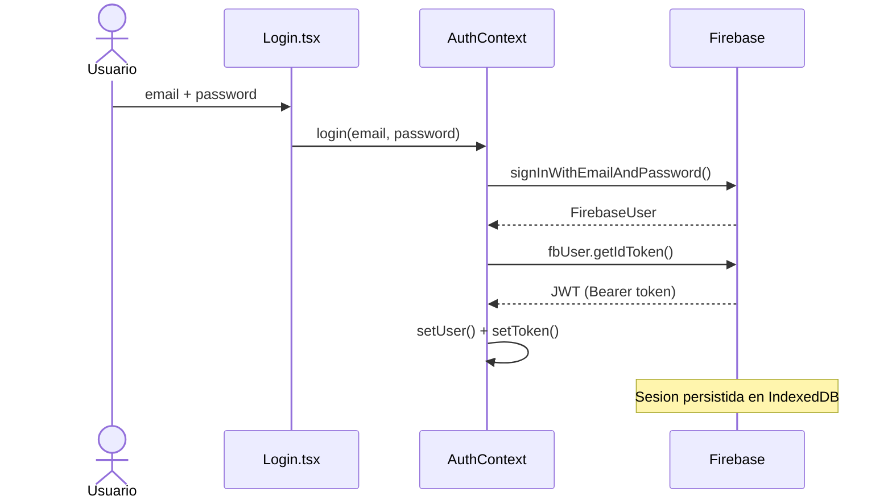

# UniLib — University Library SPA

**Live URL:** https://capstone-six-ashy.vercel.app

---

## Parte 1 — Pruebas

Escribi pruebas para los 3 componentes mas criticos y el hook useFetch usando Vitest y React Testing Library.

```bash
npm test
```

*Resultado de las pruebas corriendo:*


| Archivo | Por que es critico |
|---|---|
| Login.test.tsx | Punto de entrada — si el formulario falla nadie puede entrar |
| ProtectedRoute.test.tsx | Controla el acceso a rutas protegidas |
| BookCard.test.tsx | Componente que mas se repite en pantalla |
| useFetch.test.ts | Todos los datos de la app pasan por este hook |

Para simular dependencias externas use vi.mock(). Asi mockeé axios:

```ts
vi.mock('axios');
const mockedAxios = vi.mocked(axios, true);
mockedAxios.get = vi.fn().mockResolvedValue({ data: { books: ['Book A'] } });
```

Y asi mockeé Firebase para no hacer llamadas reales en los tests:

```ts
vi.mock('../context/AuthContext', () => ({
  useAuth: vi.fn(),
}));
```

---

## Parte 2 — Autenticacion

Conecte la app a Firebase Authentication. El token es un JWT real firmado por Firebase.



Login, registro y logout en src/context/AuthContext.tsx:

```ts
const login = async (email: string, password: string) => {
  const { user: fbUser } = await signInWithEmailAndPassword(auth, email, password);
  const t = await fbUser.getIdToken();
  setToken(t);
};

const logout = async () => {
  await signOut(auth);
};
```

El token se guarda en estado de React. Firebase persiste la sesion en IndexedDB, por eso al recargar la pagina el usuario sigue logueado sin volver a iniciar sesion.

Proteccion de rutas en src/components/ProtectedRoute/ProtectedRoute.tsx:

```tsx
if (isLoading) return <Spinner label="Checking session..." />;
if (!user) return <Navigate to="/login" state={{ from: location }} replace />;
return <>{children}</>;
```

*Login funcionando en produccion:*


*Usuarios registrados en Firebase Console:*


---

## Parte 3 — Despliegue

Desplegue la app en Vercel conectando el repositorio de GitHub. Cada push a main redespliega automaticamente.

Para que las rutas del SPA funcionen despues de un hard refresh agregue vercel.json:

```json
{
  "rewrites": [{ "source": "/(.*)", "destination": "/" }]
}
```

Las variables de Firebase las configure en el dashboard de Vercel para no exponer credenciales en el repositorio.

*App corriendo en produccion:*


---

## Stack

| Capa | Tecnologia |
|---|---|
| UI | React 18 + TypeScript |
| Routing | React Router DOM v6 |
| Estilos | CSS Modules + SASS |
| HTTP | Axios + hook useFetch |
| Auth | Firebase Authentication |
| Estado | Context API |
| Datos | Open Library REST API |
| Build | Vite |
| Pruebas | Vitest + React Testing Library |
| Deploy | Vercel |

---

## Desarrollo local

```bash
git clone https://github.com/web-development-SOP/capstone.git
cd capstone
npm install
npm run dev
```

Variables de entorno en .env.local:

```
VITE_FIREBASE_API_KEY=
VITE_FIREBASE_AUTH_DOMAIN=
VITE_FIREBASE_PROJECT_ID=
VITE_FIREBASE_STORAGE_BUCKET=
VITE_FIREBASE_MESSAGING_SENDER_ID=
VITE_FIREBASE_APP_ID=
```
