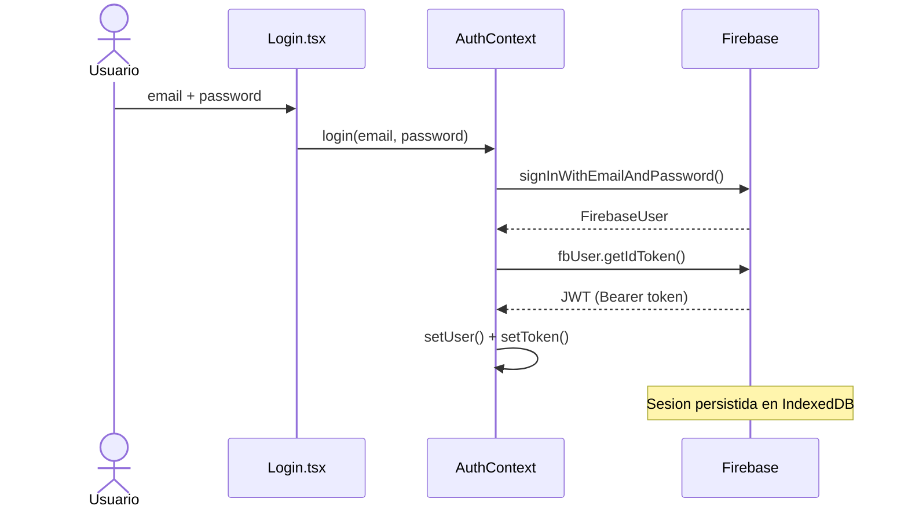

# UniLib — University Library SPA

**Live URL:** https://capstone-six-ashy.vercel.app

---

## Parte 1 — Pruebas Unitarias e Integracion

Escribi pruebas para los 3 componentes mas criticos y el hook personalizado `useFetch` usando Vitest (API compatible con Jest) y React Testing Library.

Para correr las pruebas:

```bash
npm test
```

<!-- SCREENSHOT: captura la terminal con el resultado de npm test mostrando "31 passed (31)" -->


Los archivos de prueba estan en `src/tests/`. Estos son los que escogi y por que:

| Archivo | Por que es critico |
|---|---|
| `Login.test.tsx` | Es el punto de entrada a la app — si el formulario falla nadie puede entrar |
| `ProtectedRoute.test.tsx` | Controla que rutas son accesibles — un bug aqui expone datos de otros usuarios |
| `BookCard.test.tsx` | Es el componente que mas se repite en pantalla — un error rompe todo el catalogo |
| `useFetch.test.ts` | Todos los datos de la app pasan por este hook — si falla la app queda en blanco |

Para simular dependencias externas use `vi.mock()`. Por ejemplo, asi mockeé axios en `useFetch`:

```ts
vi.mock('axios');
const mockedAxios = vi.mocked(axios, true);
mockedAxios.get = vi.fn().mockResolvedValue({ data: { books: ['Book A'] } });
```

Y asi mockeé Firebase en los tests de `Login` y `ProtectedRoute` para no hacer llamadas reales:

```ts
vi.mock('../context/AuthContext', () => ({
  useAuth: vi.fn(),
}));
```

---

## Parte 2 — Integracion con Backend y Autenticacion

Conecte la app a Firebase Authentication como backend real. El token es un JWT firmado por Firebase, no uno inventado.



Implemente login, registro y logout en `src/context/AuthContext.tsx`:

```ts
const login = async (email: string, password: string) => {
  const { user: fbUser } = await signInWithEmailAndPassword(auth, email, password);
  const t = await fbUser.getIdToken();
  setToken(t);
};

const logout = async () => {
  await signOut(auth);
};
```

El token se guarda en estado de React y Firebase persiste la sesion en IndexedDB automaticamente. Al recargar la pagina `onAuthStateChanged` restaura la sesion sin hacer login de nuevo.

Las rutas protegidas usan `ProtectedRoute` en `src/components/ProtectedRoute/ProtectedRoute.tsx`:

```tsx
if (isLoading) return <Spinner label="Checking session..." />;
if (!user) return <Navigate to="/login" state={{ from: location }} replace />;
return <>{children}</>;
```

<!-- SCREENSHOT: captura el login en https://capstone-six-ashy.vercel.app/login con sesion iniciada -->


<!-- SCREENSHOT: captura Firebase Console > Authentication > Users mostrando los usuarios registrados -->


---

## Parte 3 — Despliegue

Desplegue la app en Vercel conectando el repositorio de GitHub. Cada push a `main` redespliega automaticamente.

Para que las rutas del SPA funcionen despues de un hard refresh (por ejemplo `/loans` o `/book/OL123W`) agregue `vercel.json` en la raiz:

```json
{
  "rewrites": [{ "source": "/(.*)", "destination": "/" }]
}
```

Las variables de Firebase las configure directamente en el dashboard de Vercel para no exponer credenciales en el repositorio.

<!-- SCREENSHOT: captura https://capstone-six-ashy.vercel.app abierto en el navegador mostrando la app funcionando -->


---

## Stack

| Capa | Tecnologia |
|---|---|
| UI | React 18 + TypeScript |
| Routing | React Router DOM v6 |
| Estilos | CSS Modules + SASS |
| HTTP | Axios + hook `useFetch` |
| Auth | Firebase Authentication |
| Estado | Context API |
| Datos | Open Library REST API |
| Build | Vite |
| Pruebas | Vitest + React Testing Library |
| Deploy | Vercel |

---

## Desarrollo local

```bash
git clone https://github.com/web-development-SOP/capstone.git
cd capstone
npm install
npm run dev
```

Variables de entorno en `.env.local`:

```
VITE_FIREBASE_API_KEY=
VITE_FIREBASE_AUTH_DOMAIN=
VITE_FIREBASE_PROJECT_ID=
VITE_FIREBASE_STORAGE_BUCKET=
VITE_FIREBASE_MESSAGING_SENDER_ID=
VITE_FIREBASE_APP_ID=
```
