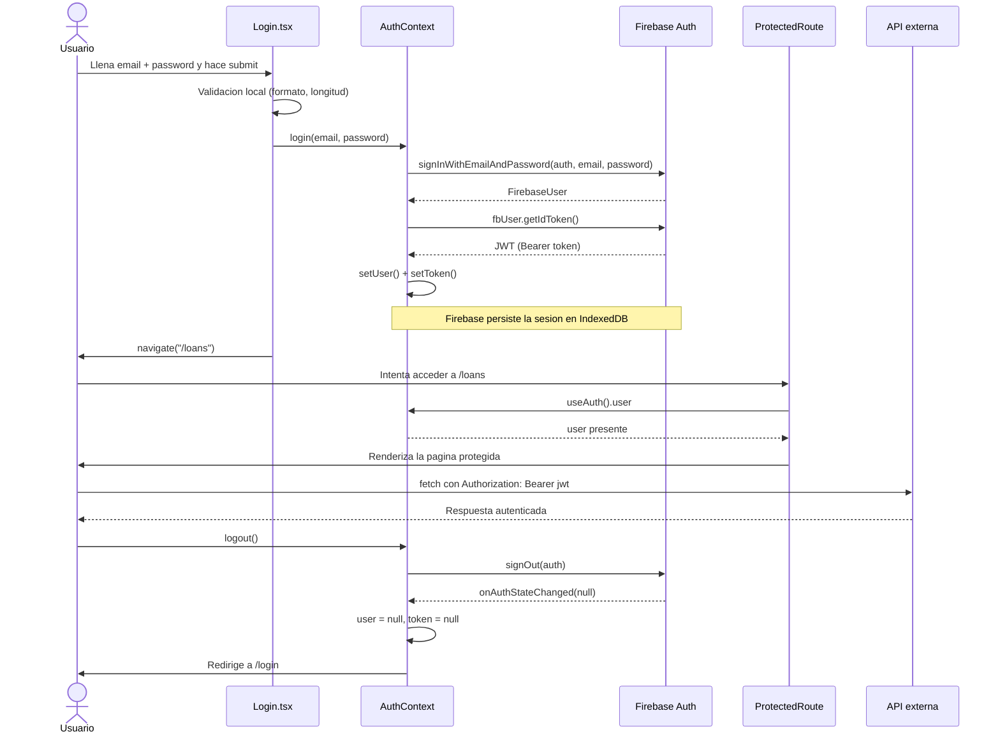

# Pruebas y Autenticacion — Task_6

---

## Parte 1: Casos de Prueba — Login

El formulario de login en src/pages/Login/Login.tsx es el punto de entrada al sistema. Los casos cubren lo que el usuario puede hacer desde la pantalla.

### Renderizado inicial

- Al llegar a /login se ven el campo de correo, el campo de contrasena y el boton "Sign In".

### Validacion del formulario

- Clic en "Sign In" sin llenar nada: aparecen "Email is required" y "Password is required", el formulario no se envia.
- Correo con formato invalido (ej. usuariosinArroba): aparece "Enter a valid email".
- Contrasena menor a 4 caracteres: aparece "At least 4 characters".

### Flujo exitoso

- Credenciales validas + clic en "Sign In": login() se llama exactamente una vez con email y password.
- Tras el login, el usuario es redirigido a / o a la ruta de donde venia (como /loans).

### Error de credenciales

- Firebase rechaza las credenciales: aparece "Invalid email or password." en pantalla, el usuario permanece en /login.

---

## Parte 2: Probando el Hook useFetch

El hook esta en src/hooks/useFetch.ts. Recibe una URL y devuelve data, isLoading y error. Internamente usa axios.get().

Para probarlo se usa renderHook de React Testing Library, que ejecuta el hook de forma aislada sin necesidad de un componente.

```ts
const { result } = renderHook(() => useFetch<Book[]>('https://openlibrary.org/search.json'));
```

### Que hay que mockear

axios hace peticiones HTTP reales. En tests eso es impredecible y lento, por eso se reemplaza con una version falsa:

```ts
vi.mock('axios');
const mockedAxios = vi.mocked(axios, true);
```

A partir de ahi se controla que devuelve axios en cada caso.

### Casos cubiertos

| Caso | Simulacion | Verificacion |
|---|---|---|
| URL nula | Sin peticion | isLoading false, data null |
| Cargando | Promesa que nunca resuelve | isLoading true |
| Exito | axios.get resuelve con datos | data tiene los libros, error null |
| Error de red | axios.get lanza error | error tiene el mensaje, data null |

Ejemplo del caso de exito:

```ts
mockedAxios.get = vi.fn().mockResolvedValue({ data: { books: ['Book A'] } });

const { result } = renderHook(() => useFetch('https://example.com/api'));

await waitFor(() => expect(result.current.isLoading).toBe(false));
expect(result.current.data).toEqual({ books: ['Book A'] });
```

Se le indica al axios falso que resuelva con datos especificos, luego se espera a que isLoading sea false y se verifica que data tenga lo esperado.

---

## Parte 3: Flujo de Autenticacion Basado en Tokens

UniLib usa Firebase Authentication con email y password. El token es un JWT real firmado por Firebase, valido por una hora.

### Diagrama del flujo



### Descripcion paso a paso

**1. Validacion local**

Antes de llamar a Firebase, Login.tsx verifica que el correo tenga formato valido y que la contrasena no este vacia. Si algo falla muestra el error y no continua.

**2. Llamada a Firebase**

AuthContext recibe el email y password y llama a signInWithEmailAndPassword. Esta funcion se comunica con los servidores de Firebase.

```ts
const { user: fbUser } = await signInWithEmailAndPassword(auth, email, password);
```

**3. Obtencion del token**

Con el usuario autenticado, se solicita el JWT:

```ts
const t = await fbUser.getIdToken();
setToken(t);
```

El token se guarda en estado de React. Firebase ademas persiste la sesion en IndexedDB del navegador, por eso al recargar la pagina el usuario sigue logueado.

**4. Proteccion de rutas**

ProtectedRoute.tsx lee el estado de auth antes de mostrar cualquier pagina protegida:

```tsx
if (isLoading) return <Spinner label="Checking session..." />;
if (!user) return <Navigate to="/login" state={{ from: location }} replace />;
return <>{children}</>;
```

Mientras Firebase resuelve la sesion guardada muestra un spinner. Si no hay usuario, redirige. Si hay usuario, renderiza el contenido.

**5. Peticion autenticada**

El token disponible en useAuth().token se envia como encabezado HTTP en cualquier llamada que lo requiera:

```ts
Authorization: Bearer <jwt>
```

El servidor verifica la firma del JWT con las claves publicas de Firebase para confirmar que la peticion es legitima.

**6. Cierre de sesion**

Al llamar logout(), Firebase limpia la sesion de IndexedDB. El listener onAuthStateChanged dispara con null, lo que resetea user y token a null y redirige al usuario a /login.
